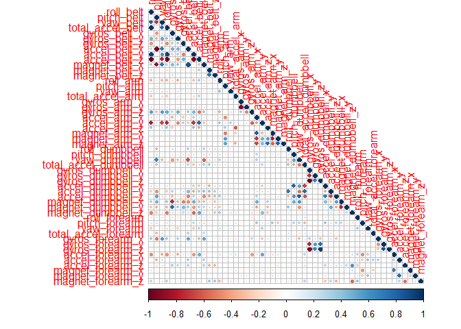
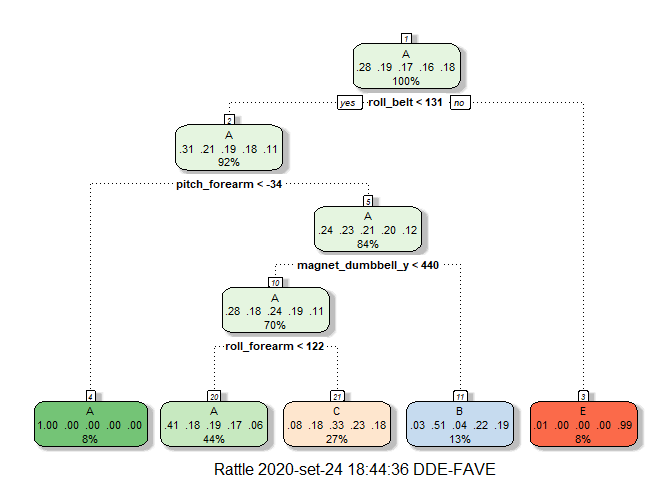

# Executive Summary
In this Analysis we analyze the **Human Activity Recognition**. The dataset has data from accelerometers on the belt, forearm, arm, and dumbell of 6 participants, that has been asked to perform barbell lifts correctly and incorrectly in 5 different ways. 
We want to create a model to predict the **manner in which they did the exercise** using the some **linear regression models**.
We will use the development model to predict 20 different test cases available in the prediction case dataset.

# 1.1 Load data and basic exploratory data analysis and Data Cleaning


Download and read the csv Training and Prediction dataset; then we split the training dataset in a **training and test dataset** with the proportion of **70/30** for **cross validation**.
We'll work on the training data set.

## Loading Data and create training dataset

```r
temp <- tempfile()
download.file(paste0("https://d396qusza40orc.cloudfront.net/predmachlearn/pml-training.csv"), destfile=temp,   mode="wb")#,method="libcurl")
## READING DATASET 
source_training_dataset <- read.csv2(temp, sep=",", stringsAsFactors = FALSE)
unlink(temp)

temp <- tempfile()
download.file(paste0("https://d396qusza40orc.cloudfront.net/predmachlearn/pml-testing.csv"), destfile=temp,   mode="wb")#,method="libcurl")
## READING DATASET 
prediction_final_dataset <- read.csv2(temp, sep=",", stringsAsFactors = FALSE)
unlink(temp)

intrain <- createDataPartition(source_training_dataset$classe, p=0.7, list=FALSE)
training <- source_training_dataset[intrain,]
test <- source_training_dataset[-intrain, ]
```

## Explorative Analysis

```r
# "classe" variable is the manner in which they did the exercise
print( paste0("The training dataset has ", ncol(training), " variables, and ", nrow(training), " rows"))
```

[1] "The training dataset has 160 variables, and 13737 rows"

```r
#hide results too wide

#summary(training)

#str(training)
```

## Cleaning the dataset
The Basic Explorative Analisis shows there are many variables with a lot of NA, we procede **removing columns with more than 50% of NAs.**

```r
## Remove columns with more than 50% NA
training <- training[, which(colMeans(!is.na(training)) > 0.5)]
```


Now We remove the **near 0 variance** column from the training data set.

```r
training<-training[, -nearZeroVar(training)]
```

Now We also remove **the predictors like timestamp, windows, name of the participant**

```r
training<-training %>% select(-X, -user_name, -contains('timestamp'), -contains('window') )
```

Conver all character variables to **numeric**

```r
training<-training %>% mutate_at(vars(-classe) ,as.numeric)
```


## Analyzing correlation in feautures
In the remaining feautures we look for correlated attributes, we'll remove highly correlated attributes.

```r
# Remove further using feature selection 
correlationMatrix <- cor(training %>% select(-classe))
corrplot(correlationMatrix, type="lower")
```

<!-- -->

```r
Correlated <- findCorrelation(correlationMatrix, cutoff = 0.95)

colnames(training[,Correlated])
```

[1] "accel_belt_z"     "roll_belt"        "accel_belt_x"    
[4] "gyros_dumbbell_z"

We have few correlated variables, we keep them in the dataset, as enanchement we can consider in the future to execute a PCA to reduce correlation.


# 1.2 Prediction Models
We create 3 fit model Decision Tree, Random Forest, Gradient Boostin and then we test the out of sample performance to select the best model for our prediction.

## Decision Tree

```r
fitDT <- train(classe ~ ., data = training, method= "rpart")
fancyRpartPlot(fitDT$finalModel)
```

<!-- -->


## Random Forest

```r
# 3 times cross validation.
my_control <- trainControl(method = "cv", number = 3 )
fitRF <- train(classe ~ ., data = training, method= "rf", prox=TRUE, ntree = 100, trControl=my_control)
```

## Gradient Boosting

```r
my_control <- trainControl(method = "cv", number = 3 )
fitGBM <- train(classe ~ ., data = training, method= "gbm", verbose=FALSE, trControl=my_control )
```


# 1.3 Accuracy Test and Alghoritm Selection
Now we test the **accuracy out of sample** of the 3 models on the test set we created from original test set. 


```r
test<-test %>% mutate_at(vars(-classe) ,as.numeric)

predDT <- predict(fitDT, test)
predRF <- predict(fitRF, test)
predGBM <- predict(fitGBM, test)

accuracyDT <-  confusionMatrix(as.factor(test$classe), as.factor(predDT))
accuracyRF <-  confusionMatrix(as.factor(test$classe), as.factor(predRF))
accuracyGBM <- confusionMatrix(as.factor(test$classe), as.factor(predGBM))

kable((rbind( c(ModelFit= "Decision Tree",accuracyDT$overall[1]), c(ModelFit= "Random Forest",accuracyRF$overall[1]), c(ModelFit= "Gradient boosting",accuracyGBM$overall[1]))))
```


ModelFit            Accuracy          
------------------  ------------------
Decision Tree       0.495497026338148 
Random Forest       0.993712829226848 
Gradient boosting   0.965845369583687 

```r
bestFit <- fitRF
```

We select the Random Forest as best fit, because the **accuracy** is of 99.3712829% and the **out of sample error** is 0.6287171% .


# 1.4 Prediction
Now we use the best fit algorithm to predict the classe of the prediction set of the exercise.

```r
prediction_final_dataset<-prediction_final_dataset %>% mutate_at(vars(-problem_id) ,as.numeric)
predict(bestFit, prediction_final_dataset)
```

 [1] B A B A A E D B A A B C B A E E A B B B
Levels: A B C D E

# 1.5 Conclusion
In this analysis we start from a wide dataset with 160 variables; initially we reduced the variables removing variables with high level on NA values and with near zero variance that can bring bias to out models.

We find that **Random Forest** is the best performing model with an accuracy out of sample of 99.3712829%

We use this model to predict the classes of a new dataset with 20 cases.
